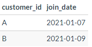
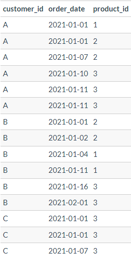
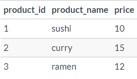

# Danny's Diner 

## Context
Danny is a big fan of Japanese cuisine. In early 2021, he took a leap of faith and opened a small restaurant, Danny’s Diner, featuring his top three favorite dishes: sushi, curry, and ramen. Despite its humble beginnings, Danny's Diner has captured some basic operational data over a few months, but Danny needs help to make sense of it and to use it effectively to improve his business.

## Problem Statement
Danny is eager to leverage the available data to answer several key questions about his customers:

1. **Customer Visiting Patterns**: Understanding how frequently customers visit the diner.
2. **Customer Spending**: Analyzing how much money customers have spent.
3. **Favorite Menu Items**: Identifying which menu items are most popular among customers.

By gaining these insights, Danny aims to enhance customer relationships, deliver more personalized experiences, and make informed decisions about potentially expanding the customer loyalty program. Additionally, Danny needs assistance in generating basic datasets for his team to inspect data without requiring SQL expertise.

## Datasets
The following datasets are provided to help analyze the data and answer the questions:
- `members`: Information about the members.
  

- `sales`: Records of sales transactions.

- `menu`: Details of the menu items offered.

